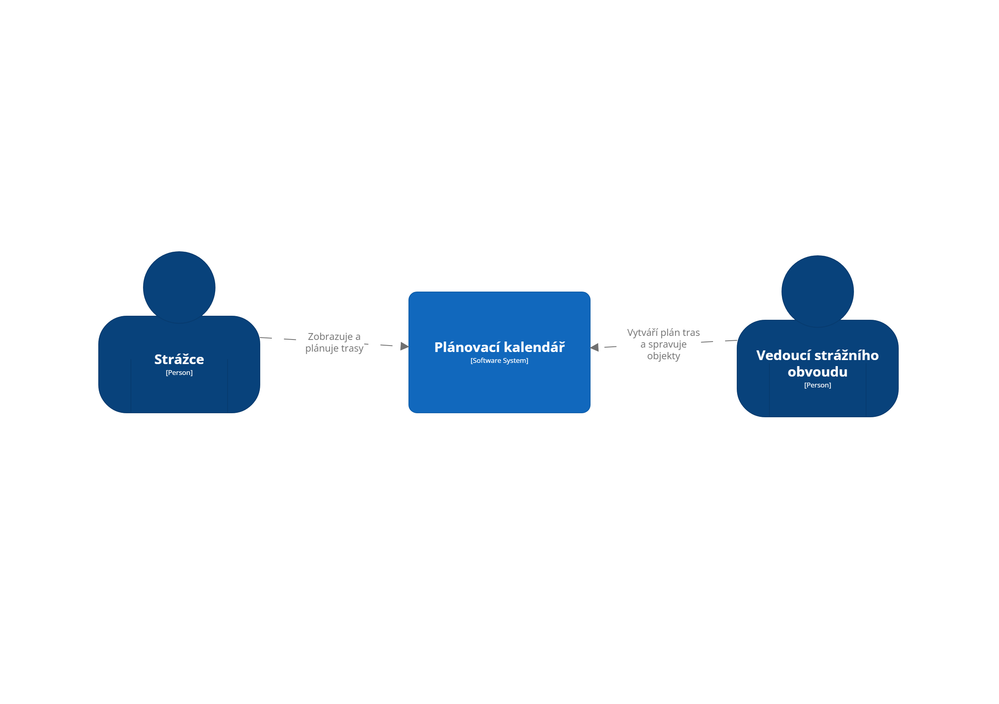
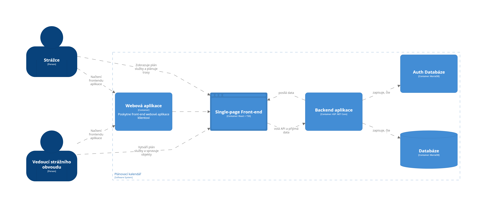
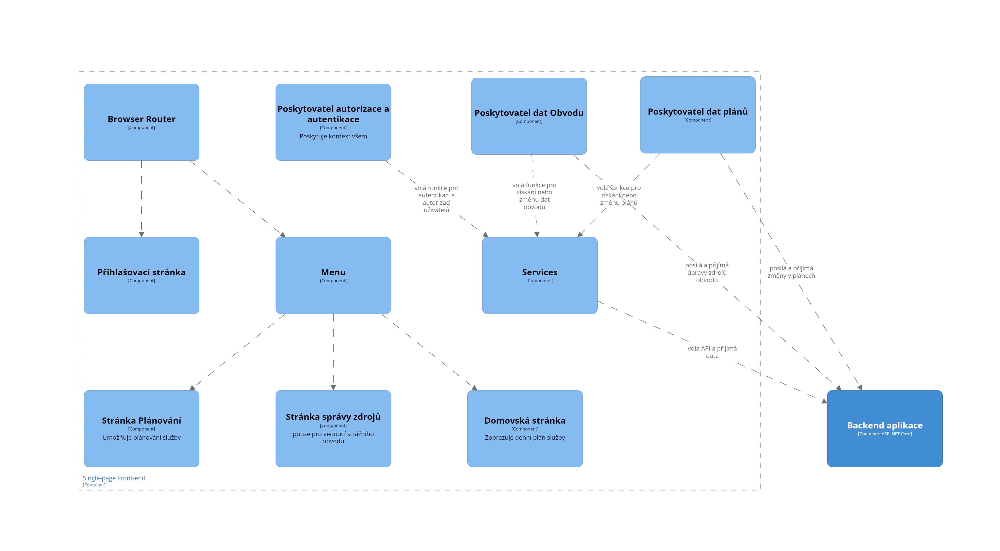
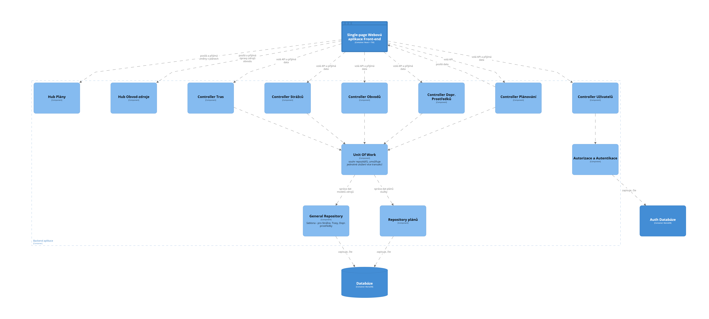

# Plánování služby strážců
Tento dokument obsahuje popis architektury webové aplikace pro plánování služby strážců.

## Obsah
- [Plánování služby strážců](#planovani-sluzby-strazcu)
    - [Obsah](#obsah)
    - [Úvod](#uvod)
    - [Základní informace o systému](#zakladni-informace-o-systemu)
    - [Front-end webové aplikace](#front-end-webove-aplikace)
        - [Browser router](#browser-router)
        - [Services](#Services)
        - [Poskytovatel Dat Plánů](#poskytovatel-dat-planu)
        - [Poskytovatel Dat Obvodu](#poskytovatel-dat-obvodu)
        - [Poskytovatel Autentizace a autorizace](#poskytovatel-autentizace-a-autorizace)
        - [Přihlašovací stránka](#prihlasovaci-stranka)
        - [Menu](#menu)
        - [Stránka plánování](#stranka-planovani)
        - [Stránka správy zdrojů](#stranka-spravy-zdroju)
        - [Domovská stránka](#domovska-stranka)
    - [Backend aplikace](#backend-aplikace)
        - [Kontrolery](#kontrolery)
        - [Unit of Work](#unit-of-work)
        - [Repozitáře](#repozitare)
        - [Huby](#huby)
        - [Autentikace a autorizace](#autentikace-a-autorizace)

## Úvod
Aplikace Plánovací kalendář je určena pro strážce a vedoucí strážních obvodů národního parku. 
Strážcům umožňuje zobrazit si plán služby a naplánovat si trasy.
Vedoucím strážních obvodů umožňuje vytvářet plán služby a spravovat objekty v obvodu.

*C4 diagram Level 1: Plánovací kalendář*

## Základní informace o systému
Plánovací kalendář je webová aplikace, která slouží k plánování služby strážců v reálném čase a zobrazování plánů na den.
Aplikace poskytne klientovi front-end, který umožňuje uživateli interagovat se systémem a měnit plán služby.
Front-end webové aplikace využívá knihovnu React s Typescriptem. 
Uživatelské rozhraní zobrazuje a pracuje s daty, které jsou načtené z backendu ASP.NET Core prostřednictím volání API kontrolerů. 
Aby byla data aktuální přes všechna zařízení, je backend využit také na posílání informací o provedených změnách.
Backend čte a zapisuje data do dvou databází MariaDB: jedna obsahuje aplikační data o objektech (trasy, strážci, dopravní prostředky atd.) a druhá je určena pro autentikační data o identitách a rolích uživatelů.

*C4 diagram Level 2: Kontejnery Plánovacího kalendáře*
### Front-end webové aplikace
Front-end webové aplikace poskytuje aplikační logiku, jako například zobrazení plánu služby, poskytnutí funkcionality plánování a spravování zdrojů. Využívá API backendu pro získání a updatování dat.
Aby měl uživatel přístup k datům aplikace je autentizován. 

V diagramu front-end webové aplikace nejsou zaznamenány vztahy vedoucí z poskytovatelů za účelem přehlednosti. Poskytují kontext aplikace, který je primárně dostupný všem stránkám.

*C4 diagram Level 2: Front-end webové aplikace*

#### Browser router
Jedná se o react-router, který je odpovědný za navigaci mezi stránkami.

#### Services
Services obsahuje množinu fetch funkcí, které volají API backendu. 
Jsou uspořádané do složek podle objektů, kterých se týkají.

#### Poskytovatel Dat Plánů
Poskytovatel Dat Plánů je odpovědný za centrální spravování plánů v rámci vybraného a právě zobrazovaného měsíce. 
Tyto plány poskytuje v rámci kontextu domovské stránce a stránce plánování. 
Při změně zobrazovaného měsíce je odpovědný za získání nových plánů pomocí Services a pokud je provedena v plánech změna, notifikuje o tom pomocí Hub Plánů ostatní klienty.

#### Poskytovatel Dat Obvodu
Poskytovatel Dat Obvodu je odpovědný za centrální spravování zdrojů obvodu (tras, dopravních prostředků, strážců).
Tyto data poskytuje v rámci kontextu domovské stránce, stránce plánování a stránce správy zdrojů. 
Pokud je provedena v zdrojích změna, notifikuje o změně ostatní klienty použitím Hub Obvod-zdroje na backendu.

#### Poskytovatel Autentizace a autorizace
Poskytovatel autentizace a autorizace spravuje stav přihlášení a ověřuje roli uživatele, tento stav v rámci kontextu poskytuje všem stránkám.
Volá funkce z Services spojené s přihlašováním a odhlašováním.

#### Přihlašovací stránka
Přihlašovací stránka je odpovědná za zobrazení přihlašovacího formuláře a navigace na hlavní stránku při úspěšném přihlášení.
Využívá funkci Poskytovatele Autentizace a autorizace pro přihlášení uživatele.

#### Menu
Menu poskytuje odkazy na stránky a funkci odhlášení.
Je odpovědná zobrazit link na stránku správy zdrojů pouze vedoucím strážního obvodu.

#### Stránka plánování
Stránka plánování je zodpovědná za zobrazení plánu služby na vybraný měsíc a umožnění kontrolovaného editování a zamykání plánů.
Využívá Poskytovatele Dat Obvodu, aby zobrazovala aktuální informace o zdrojích.
Poskytovatele autentizace a autorizace využívá, aby mohl uživatel editovat pouze pro něj povolené plány.
Poskytovatele Dat Plánů využívá na získání a správu zobrazovaných plánů.

#### Stránka správy zdrojů
Stránka správy zdrojů je zodpovědná za zobrazení tras, strážců a dopravních prostředků se všemi informacemi a je přístupná pouze pro vedoucí strážních obvodů.
Umožňuje vedoucím přidávat, mazat a editovat zdroje obvodu. 
Využívá Poskytovatele Dat Obvodu pro šíření změn napříč stránkami a do backendu. 

#### Domovská stránka
Domovská stránka je zodpovědná za zobrazování plánu služby určitého obvodu na určitý den.

### Backend aplikace
Backend slouží na zpracování požadavků frontendu a manipulaci s daty v databázi.
Poskytuje business logiku aplikace, jako například přidání trasy do plánu strážce, ověření identity uživatele nebo získání dopravních prostředků v daném obvodu.

Obsahuje:
- Kontrolery - Implementují API, které zpracovávají požadavky frontendu a posílají data.
- Unit of Work - Komponenta, která koordinuje přístup k repozitářům a jednotně ukládá změny do databáze.
- Repozitáře - Poskytují metody pro přístup a práci s objekty v databázi.
- Huby - Slouží pro posílání informací o provedených změnách, zajišťují komunikaci mezi serverem a klientem v reálném čase.
- Autorizační a autentikační logiku

*C4 diagram Level 3: Backend*

#### Kontrolery
**Kontrolery zdrojů** (trasy, strážci, obvody a dopravní prostředky) obsahují primárně pouze HTTP metody pro základní CRUD operace - tvorba nových, získání všech v daném obvodu, aktualizaci a mazání objektů.
Výjimkou je kontroler strážců, který také obsahuje metodu na získání strážce, který je přiřazený k aktuálně přihlášenému uživateli (pokud je uživatel strážcem).

**Kontroler Plánů** poskytuje API pro přidávání a odebírání tras nebo dopravních prostředků ze specifických plánů, zamknutí a odemknutí plánů v určitém dnu a získání plánů v určitém časovém rozmezí.

**Kontroler Uživatelů** poskytuje API pro přihlašování a odhlašování uživatelů, registraci nových uživatelů a správu rolí.

#### Unit of Work
Unit of work je třída, která koordinuje práci repozitářů a zajišťuje, že všechny repozitáře pracují se stejnou reprezentací databáze a tedy udržuje konzistenci dat.
Umožňuje uložit všechny změny provedené v reprezentaci databáze do reálné databáze v jednom atomickém kroku.

#### Repozitáře
Repozitáře jsou zodpovědné za přístup k datům v databázi, využívají Entity Framework a jeho DbContext pro usnadnění práce s databází.
DbContext zajišťuje mapování mezi objekty v aplikaci a tabulkami v databázi, což umožňuje snadnější práci s daty.
General Repository je obecná šablona, která implementuje rozhraní pro získávání, ukládání, mazání a aktualizaci objektů v databázi.
Je využit pro správu všech objektů kromě plánů. 
Plány jsou spravovány v Plan Repository, který implementuje stejné rozhraní, ale má specifickou metodu pro získávání plánů.

#### Huby
Huby jsou implementované pomocí SignalR a slouží k posílání informací o provedených změnách a tím udržují plán služby a informace o objektech aktuální napříč všemi klienty.

**Hub Plány** slouží k posílání notifikací o změnách konkrétního plánu skupině klientů.
Umožňuje klientům přidat se do skupiny podle obvodu, ve kterém jsou, a měsíce, kterého plány sledují. 
Díky skupinám jsou notifikace o změnách posílány pouze klientům, kterých se změny týkají.

**Hub Obvod-zdroje** slouží k posílání notifikací o změnách ve zdrojích skupině klientů. 
Umožňuje klinetům přidat se do skupiny podle obvodu. 
Notifikační metody jsou čtyři - pro posílání změn o trasách, dopravních prostředcích, strážcích a zámcích.

#### Autentikace a autorizace
Autentikace a autorizace je zodpovědná za přístup k datům v Auth databázi a využívá IdentityDbContext pro usnadnění autorizace a autentikace. 
Autentikační služba implementuje metody přihlašování, odhlašování, registrování nových uživatelů a získání informací o přihlášeném uživateli.
Autorizační služba implementuje metody pro přiřazování a ověřování rolí uživatelů.
