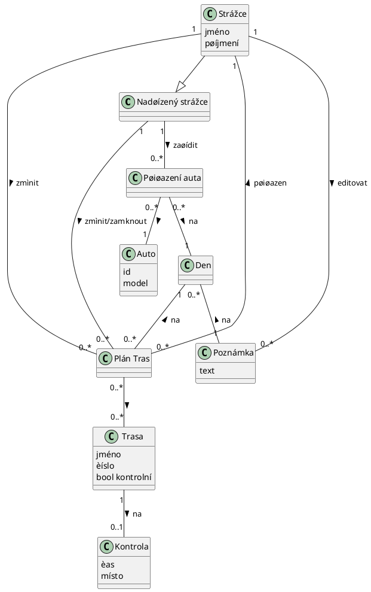

### Plánovací kalendáø pro strážce NP Šumava
Mobilní aplikace na záznam pracovní doby a naplánovaných tras pro strážce. 
Jako strážce si mohu naplánovat trasy (trasy jsou reprezentovány èíselnými kódy, tedy množina èíselných kódù)  na urèitý den a zaznamenat pracovní dobu. Jako strážce mám možnost na konci týdne zhodnotit týden ve formì poznámky. 
Jako nadøízený strážce mohu strážcùm upravit naplánované trasy a zamknout zmìny tak, aby sám strážce již do plánu nezasahoval, ale já sám mohu zámek odemknout a plán zmìnit pokud je tøeba. Jako nadøízený mohu také generovat statistiky pro jednotlivé trasy za urèité období, neboli filtrovat podle tras. Mohu také kontrolovat odpracované doby pro jednotlivé strážce v rámci mìsíce. Všechny data by mìli být uložené zpùsobem, aby se dali exportovat ve formátu excelové tabulky. 

___
[Design pro mobilní aplikaci](Figma-mobile.pdf)

---
#### Doménový model
[Doménový model](prilohy/domenovy_model.png)
