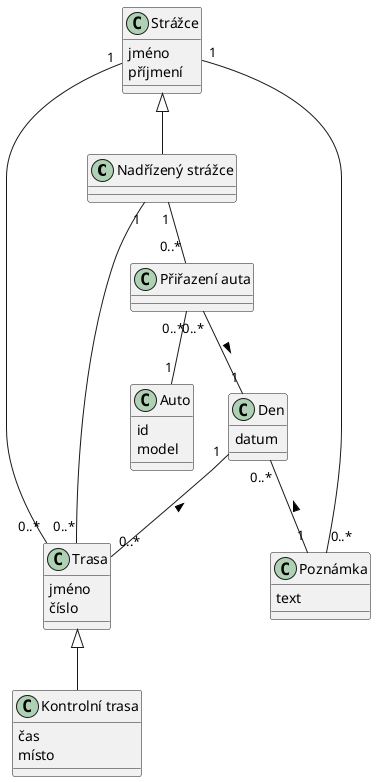

### Plánovací kalendář pro strážce NP Šumava
Mobilní aplikace na záznam pracovní doby a naplánovaných tras pro strážce. 
Jako strážce si mohu naplánovat trasy (trasy jsou reprezentovány číselnými kódy, tedy množina číselných kódů)  na určitý den a zaznamenat pracovní dobu. Jako strážce mám možnost na konci týdne zhodnotit týden ve formě poznámky. 
Jako nadřízený strážce mohu strážcům upravit naplánované trasy a zamknout změny tak, aby sám strážce již do plánu nezasahoval, ale já sám mohu zámek odemknout a plán změnit pokud je třeba. Jako nadřízený mohu také generovat statistiky pro jednotlivé trasy za určité období, neboli filtrovat podle tras. Mohu také kontrolovat odpracované doby pro jednotlivé strážce v rámci měsíce. Všechny data by měli být uložené způsobem, aby se dali exportovat ve formátu excelové tabulky. 

___
[Design pro mobilní aplikaci](https://www.figma.com/file/B96k04ObDK4yaycN5ulT1I/NP-strazci?node-id=0%3A1&t=VeApoPs8S3MXuRlP-1)

---
#### Doménový model
[Doménový model](prilohy/domenovy_model.png)
